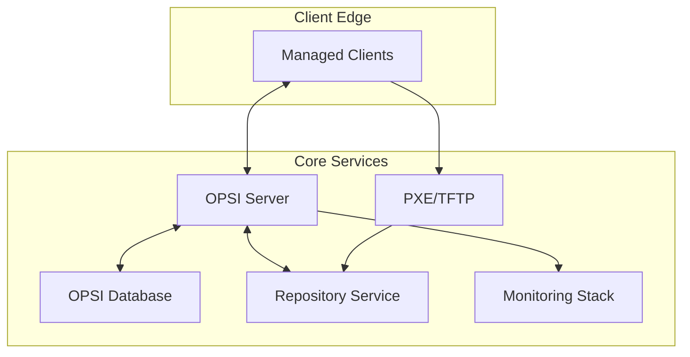

# Architecture Overview

## Purpose
This reference describes the logical and physical architecture of OpsiSuit so that engineers can understand component responsibilities, data flows, and scaling considerations.

## Service Topology

- **OPSI Server:** Orchestrates deployments, inventory collection, and exposes ConfigAPI.
- **Database:** Stores configuration, inventory, and event history.
- **Repository:** Supplies packages and OS images over HTTP/SMB.
- **PXE/TFTP:** Boots bare-metal clients and triggers OS installs.
- **Monitoring Stack:** Observes metrics, logs, and alerts on anomalies.

## Deployment Modes
| Mode | Description | Use Case |
| --- | --- | --- |
| Single-node | All services share a host with Docker Compose orchestration. | Labs, proof of concept. |
| Multi-node | Database and repository on dedicated hosts; OPSI server + PXE on another. | Medium deployments needing isolation. |
| Hybrid cloud | Database as managed service, repository in object storage (S3), compute in cloud VMs. | Distributed organisations with remote offices. |

## Data Flows
1. Client requests assignments from OPSI server over HTTPS.
2. OPSI server queries database for policy decisions.
3. Client downloads packages from repository (HTTP/SMB).
4. Inventory results posted back to OPSI server, stored in database.
5. Monitoring stack scrapes metrics and logs from all services.

## Scaling Considerations
- **Horizontal:** Add additional depot servers or repositories; leverage load balancers for web UI.
- **Vertical:** Increase CPU/memory for database and OPSI server as client base grows.
- **Network:** Separate deployment traffic from management traffic using VLANs or QoS.

## Security Zones
- **Management Zone:** Contains OPSI server, database, repository. Protected by firewalls and VPN.
- **Provisioning Zone:** Hosts PXE/TFTP with restricted ingress from staging networks.
- **Client Zone:** Endpoints communicate inbound to management zone only.

## Dependency Matrix
| Component | Depends On | Notes |
| --- | --- | --- |
| OPSI Server | Database, Repository, PXE (optional) | Requires low latency to DB. |
| PXE/TFTP | DHCP/Proxy, Repository | Needs host networking privileges. |
| Repository | Storage backend | Should be backed by resilient storage. |
| Monitoring | All services | Pulls metrics/logs via exporters. |

Refer back to [Container Platform & Topology](../setup/02-container-platform.md) for implementation details.
